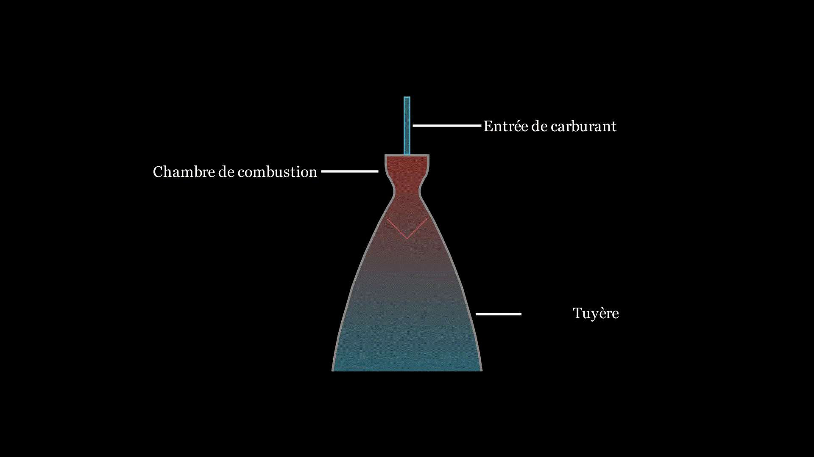

# Cas n°1 : moteur fusée
### Structure du système

### Énoncé
On souhaite controller la température dans la chambre de combustion d'un moteur de fusée car si elle est trop élevée, le moteur peut exploser. On dispose d'un capteur de température, mais il est déporté car autrement il ne résisterait pas très longtemps à la chaleur. On souhaite donc estimer la température dans la chambre de combustion, sachant qu'on ne peut pas la mesurer directement.

### Dynamique du système
Le carburant en combustion fait chauffer la chambre de combustion. Ensuite, la chambre de combustion évacue sa chaleur par rayonnement vers le vide ou par conduction vert d'autres éléments. Pour finir, une infime partie de la chaleur est transmise au compartiment du capteur, par conduction.
<!-- diagramme des échanges thermiques-->


```math
\textbf{Vecteur d'état :} \\[3mm]
X = \begin{bmatrix} T_{com} \\ T_{cap} \end{bmatrix} \\[3mm]

T_{com} : \text{température dans la chambre de combustion} \\
T_{cap} : \text{température au niveau du compartiment capteur}
\\[6mm]
\textbf{Vecteur de commande :} \\[3mm]

U = \begin{bmatrix} P\end{bmatrix} \\[3mm]
\ P : \textrm{la puissance thermique injectée dans la chambre de combustion.} \\[6mm]

\textbf{Modèle de prédiction :} \\[3mm]
f(X,U) = \begin{bmatrix} T_{com} + \Delta t*\frac{P}{C} * (1 - T_{cap} - T_{ext}) \\ T_{cap} + \Delta t*\alpha * (T_{com} - T_{cap}) \end{bmatrix} \\[3mm]
\begin{aligned}
&\begin{aligned}
\Delta t &: \textrm{pas de temps} \\
C &: \textrm{capacité thermique de la chambre de combustion} \\
T_{ext} &: \textrm{température extérieure} \\
\alpha &: \textrm{coefficient de conduction entre la chambre de combustion et le compartiment capteur}
\end{aligned}
\end{aligned}
\\[6mm]
\textbf{Modèle de mesure :} \\[3mm]
h(X) = \begin{bmatrix} T_{cap} \end{bmatrix} \\[3mm]
\begin{aligned}
&\begin{aligned}
T_{cap} &: \textrm{température au niveau du compartiment capteur}
\end{aligned}
\end{aligned}
```

